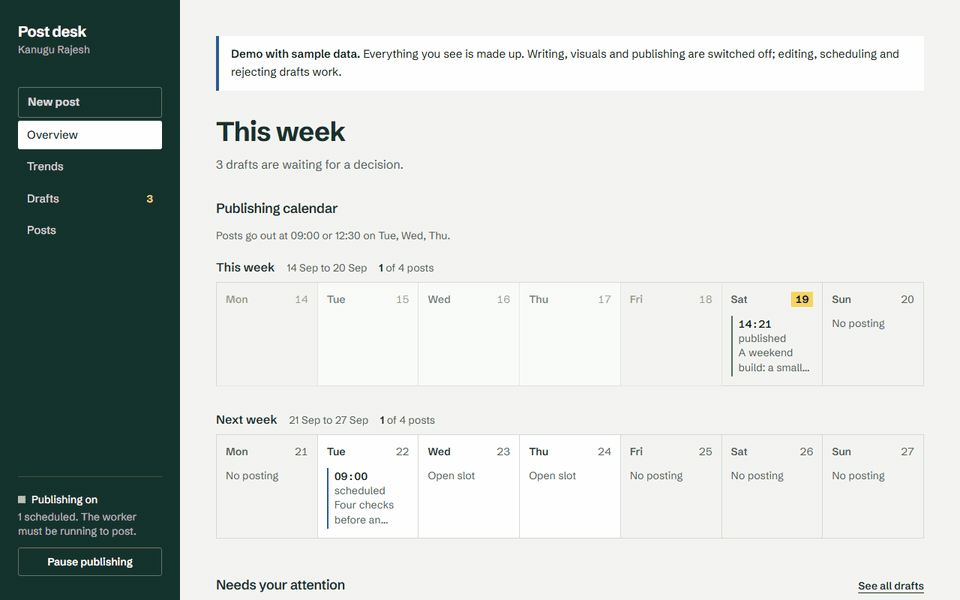
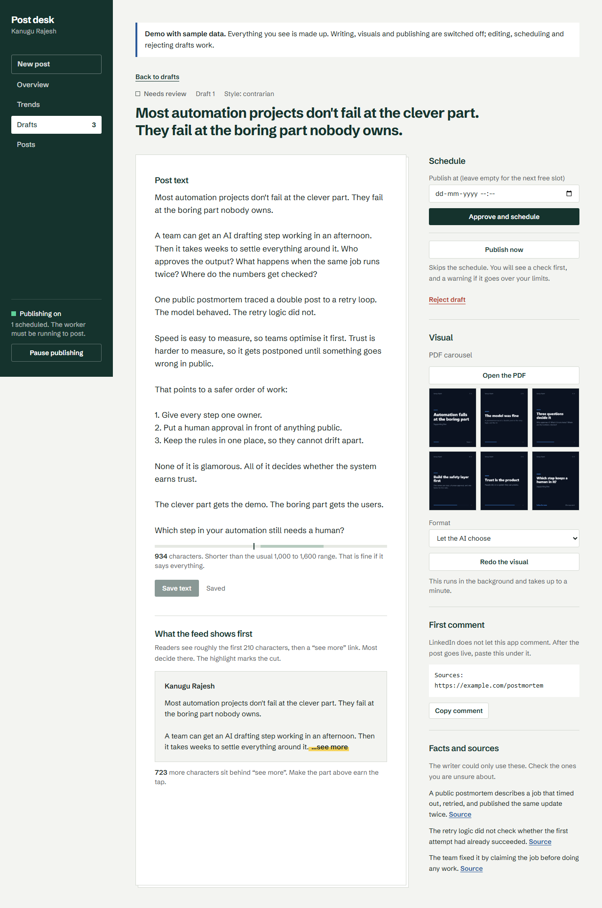
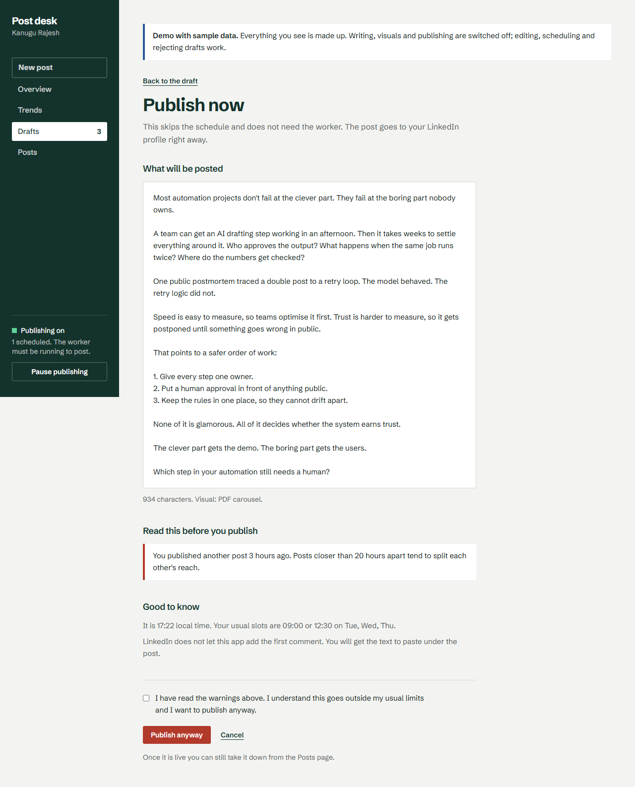
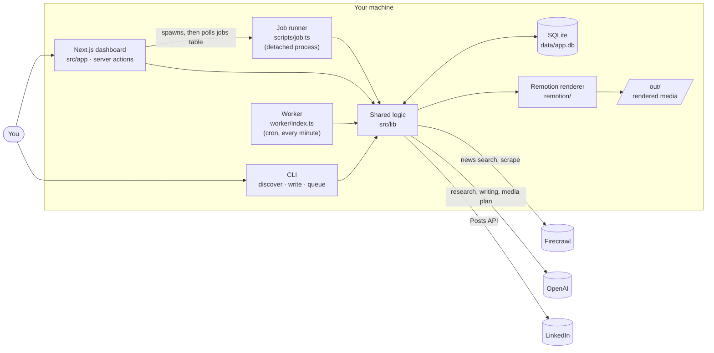
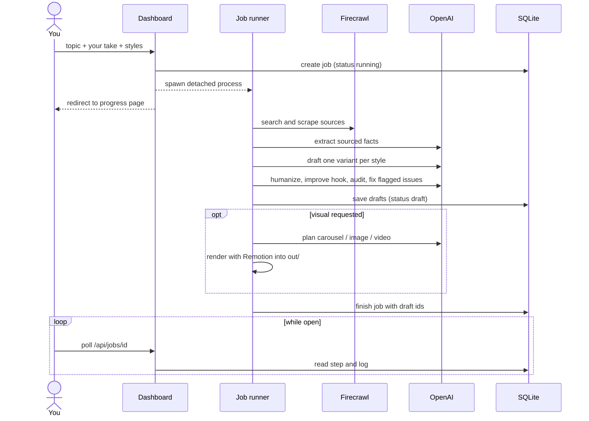
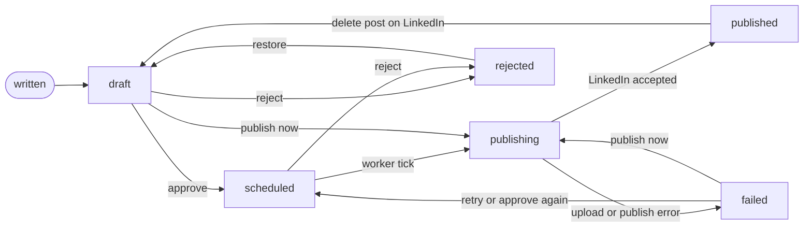
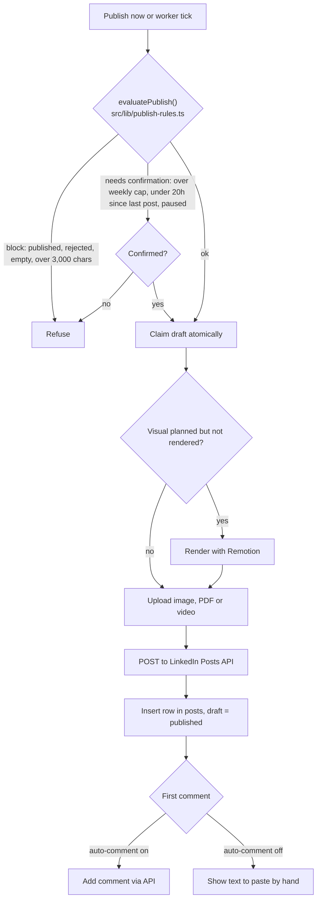
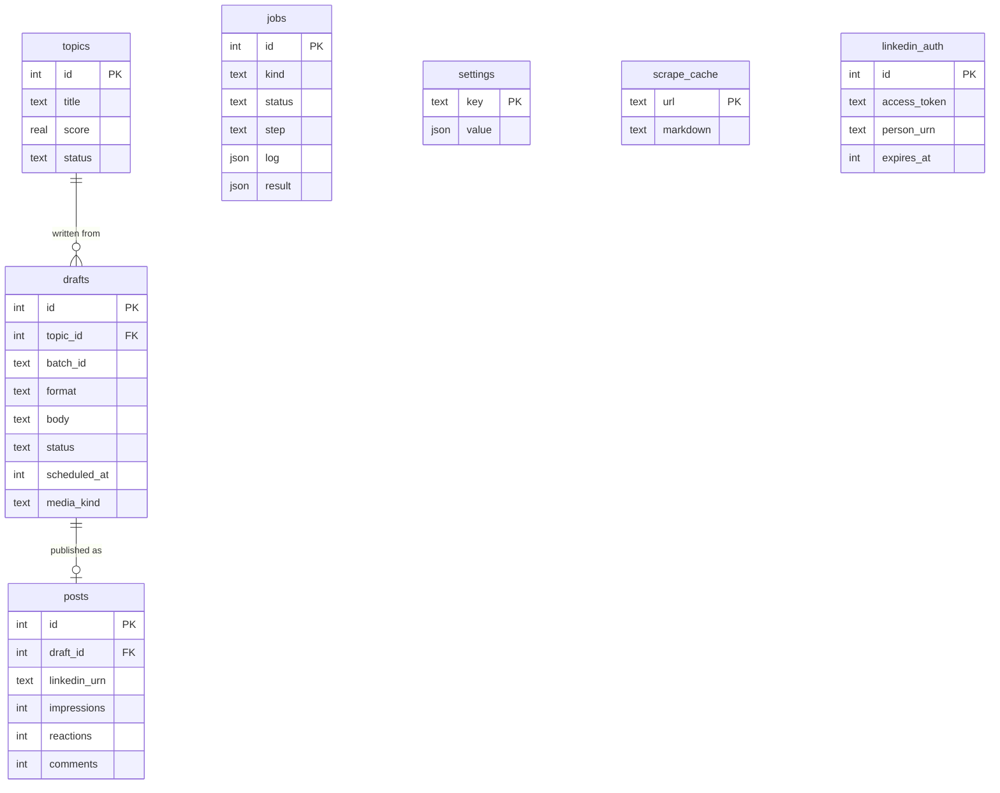

# Post desk: a LinkedIn content pipeline you approve

[](https://github.com/kanugurajesh/linkedin-automation/actions/workflows/ci.yml)

Finds trending topics, researches them on the web, drafts posts around **your own take**, renders a carousel, image or short video, and publishes to LinkedIn on a schedule. Every post is reviewed and approved by a person. Nothing goes out on its own.



*The walkthrough uses sample data.*

## Try it in one minute (no API keys)

```bash
git clone https://github.com/kanugurajesh/linkedin-automation
cd linkedin-automation
npm install
npm run demo        # then open http://127.0.0.1:3200
```

Needs Node 22.9 or newer. The demo builds the app once, loads made-up sample data into its own database (`data/demo.db`), and switches off everything that would reach a real service (AI, web research, LinkedIn). Editing, scheduling, rejecting and restoring drafts, the publish-now safety check and the calendar all work.

## What it looks like

| Editor with a live "what the feed shows first" preview | Publish now, with a check before anything goes out |
| --- | --- |
|  |  |

More: [overview and calendar](docs/screenshots/overview.png), [new post form](docs/screenshots/new-post.png), [progress page](docs/screenshots/job.png), [trends](docs/screenshots/trends.png), [posts and metrics](docs/screenshots/posts.png).

## How it works

```
discover -> pick a topic + your take -> write drafts -> visual (optional) -> review -> approve -> schedule -> publish -> log metrics
Firecrawl          you                    OpenAI          Remotion            you       you       worker      LinkedIn      you
```

- **Discovery:** Firecrawl news search per niche keyword plus Hacker News and Product Hunt front pages. Near-duplicate stories are merged and scored on recency, how many outlets carry them, engagement and niche fit.
- **Research:** scrapes the top sources and extracts sourced facts. The writer may only use those facts.
- **Writing:** drafts in the styles you pick, then a rewrite pass, a hook pass and automatic checks (banned AI phrases, links in the body, numbers not in the research, invented personal experience).
- **Visuals:** Remotion templates render a PDF carousel, an image card or a 15-second stat video from the post's own wording.
- **Publishing:** LinkedIn's Posts API for text, image, PDF carousel and video.

## Architecture

Everything runs on one machine and shares one SQLite database. There is no queue server and no cloud dependency besides the three external APIs.

### Processes and services



| Process | Started by | Job |
| --- | --- | --- |
| **Dashboard** (`src/app`) | `npm run dev` / `npm run start`, bound to `127.0.0.1` | Pages, server actions, and a route that serves rendered media for previews. It only does quick database work itself. |
| **Job runner** (`scripts/job.ts`) | The dashboard, as a detached child process per job | Long work: `write`, `visual` and `publish`. Writes progress to the `jobs` table, so a reload or closed tab does not stop it. |
| **Worker** (`worker/index.ts`) | `npm run worker` | Every minute, publishes the next due draft unless publishing is paused or the weekly cap is reached. |
| **CLI** (`scripts/*.ts`) | You | The same operations as the dashboard, from the terminal. |

All four are thin entry points over `src/lib`, which is where the behaviour lives.

### Writing a post



The job page polls `/api/jobs/[id]`. A `running` job that has not reported progress for 20 minutes is marked failed on the next read, so the page never spins forever.

### Draft lifecycle



Moving into `publishing` is a single conditional `UPDATE ... WHERE status IN (...)`. Whoever wins that update publishes, and the loser gets an error, which is why the worker and a manual publish cannot both post the same draft. After the post is live, the draft is never moved back to `failed`, even if the first comment or a database write fails afterwards.

### Publishing



### Data model



`jobs` and `settings` (which holds the pause switch) stand alone. `scrape_cache` avoids scraping the same URL twice. The schema is in `src/lib/db/schema.ts` and is applied with `npm run db:push`.

### Design decisions

- **Separate processes over in-request work.** Writing and rendering take a minute or more. Running them in a detached process, with progress in the database, means a Next.js restart or a closed browser tab cannot lose a job. The cost is that the web app and the runner communicate only through SQLite.
- **The database is the only shared state.** The dashboard, worker, job runner and CLI never call each other. SQLite in one file keeps setup to `npm run db:push`, at the price of needing a real disk, which is why it does not run on serverless platforms.
- **Two queue modules.** `queue-core.ts` holds database-only operations, so the dashboard can import it without pulling in Remotion or OpenAI. `queue.ts` re-exports it and adds the steps that render or call a model.
- **Rules as a pure function.** `publish-rules.ts` takes plain data and returns checks. The dashboard, the job runner, the CLI and the server action all call it, and it is unit-tested without a database.
- **Server actions validate their own input.** They are reachable by direct POST, so every field is checked in `src/app/actions.ts`, and the job runner re-runs the publish checks before publishing.
- **Local-only by design.** There is no login. The dev and start scripts bind to `127.0.0.1`, and demo mode (`DEMO_MODE=1`) replaces every credential and refuses writing, rendering and publishing.

## Engineering notes

- **It does not invent your experience.** Drafts are built from scraped facts plus your one-line take. A separate audit pass checks every first-person sentence against that take (`src/lib/ai/write.ts`, `src/lib/ai/style.ts`).
- **One home for the safety rules.** The "publish now" rules are a pure function (`src/lib/publish-rules.ts`) used by the dashboard, the background job and the CLI, and the server re-checks them before publishing, so the confirmation cannot be skipped from the browser.
- **Nothing double-posts.** A draft is claimed atomically before it is published (`src/lib/publish.ts`). If the post is live but a later step fails, the draft stays "published", because retrying would duplicate it.
- **Long work runs off the request.** Writing, rendering and publishing run as separate processes with progress in a `jobs` table (`scripts/job.ts`), so a reload or a closed tab does not interrupt them.
- **Tested logic.** The pure logic (writing rules, trend scoring, slot scheduling and time zones, publish rules, LinkedIn text escaping, metrics parsing, the feed fold) has a Vitest suite. The tests were spot-checked by deliberately breaking rules (weekly cap, slot gap, writing lint, metrics parsing, LinkedIn escaping) and confirming they fail. CI runs typecheck, lint, tests and build on every push.

## What works and what doesn't

| Works | Doesn't (yet) |
| --- | --- |
| Topic discovery, scored and de-duplicated | Automatic first comment: LinkedIn blocks it for apps with only "Share on LinkedIn", so the text is shown for you to paste |
| Research with sourced facts only | Reading impressions/reactions from LinkedIn: needs a restricted API, so you enter numbers by hand (or import a CSV) |
| Drafts in several styles, humanized, linted and audited | Automatic learning from results |
| Visuals: PDF carousel, image card, 15s stat video | Hosting on serverless platforms: it needs a disk and long-running processes |
| Publish text, image, PDF carousel, video; delete posts | A login: it is meant to run on localhost |
| Scheduler with a weekly cap and a pause switch | |
| Write from the browser, with background progress | |
| Publish now with checks and a required confirmation when over your limits | |

## Setup with your own keys

Requirements: Node 22.9+, a Firecrawl key, an OpenAI key, and a LinkedIn developer app with the **Share on LinkedIn** and **Sign In with LinkedIn using OpenID Connect** products.

```bash
npm install
cp .env.example .env.local      # then fill it in
npm run db:push                 # creates data/app.db
```

`.env.local`:

| Variable | Notes |
| --- | --- |
| `FIRECRAWL_API_KEY`, `OPENAI_API_KEY` | required |
| `OPENAI_MODEL` | any chat model your account can use; a stronger model writes noticeably better |
| `LINKEDIN_CLIENT_ID`, `LINKEDIN_CLIENT_SECRET`, `LINKEDIN_REDIRECT_URI` | from your LinkedIn app; the redirect URI must be registered in the app |
| `LINKEDIN_ACCESS_TOKEN`, `LINKEDIN_PERSON_URN` | optional if you use `npm run linkedin:auth` |
| `TIMEZONE`, `MAX_POSTS_PER_WEEK` | scheduling |
| `LINKEDIN_AUTO_COMMENT` | keep `false` unless your app has the Community Management API |

Then edit the config files to be yours:

- `config/niche.ts`: your content pillars and keywords (drives discovery)
- `config/brand.ts`: name, handle and colors on generated visuals
- `config/schedule.ts`: posting days and times
- `voice/samples.md`: paste 5–10 of your own posts, separated by `---`. Without it, a neutral default voice is used.

Connect LinkedIn: `npm run linkedin:auth` opens the OAuth flow and stores the token. Tokens last about 60 days; re-run it before then. Check status any time with `npm run queue -- auth`.

## Dashboard

```bash
npm run dev      # http://127.0.0.1:3000 (bound to localhost only)
```

You can do the whole flow in the browser; the terminal commands below work too.

- **New post:** enter a topic (or start from a trend), your take, an optional source link and angle, pick up to three writing styles, and optionally ask for a visual for every draft. It researches and writes in the background, on a progress page that survives reloads. Deciding on the visual later is faster, because you only render one for the draft you keep.
- **Overview:** LinkedIn connection status, a two-week publishing calendar, what needs a decision, and any job that is running.
- **Trends:** the topics from `npm run discover`, each with a "Write a post from this" button.
- **Drafts:** read and edit the text with a live preview of what the feed shows before "see more", check sources, create or redo the visual, approve into the next free slot or a time you pick, reject or restore.
- **Publish now:** skips the schedule and does not need the worker. A check screen comes first (below). Afterwards you get the LinkedIn link and the first-comment text to paste.
- **Posts:** enter impressions, reactions and comments, see what performs, or delete a post from LinkedIn (confirmation required; the draft returns to your drafts and stops counting toward the weekly limit).

The dashboard has no login, so keep it on localhost and don't expose the port: anyone who can reach it can schedule or publish posts to your profile.

### The publish-now check

Before a manual publish the app checks and shows:

- **Blocks** (cannot publish): the draft is already published or rejected, the text is empty, or it is over LinkedIn's 3,000-character limit.
- **Needs your confirmation** (you must tick a box; the server enforces it): over your weekly limit (published plus scheduled this calendar week, or the last 7 days), another post less than 20 hours ago, or publishing is paused.
- **Good to know:** outside your usual posting days and hours, the visual still has to render, the first comment must be pasted by hand.

The terminal has the same rules: `npm run queue -- publish <id>` prints them and needs `--yes` to go over your limits.

## Terminal workflow

```bash
# 1. find topics (saved to the DB)
npm run discover

# 2. write drafts from a saved topic (or --text "your topic" [--url ...]); --take is required
npm run write -- --topic 33 --take "what you actually think about this"

# 3. read them, edit the one you like
npm run queue -- list --status draft
npm run queue -- show 15
npm run queue -- edit 15 --file post.txt

# 4. optional visual: the AI picks, or force --kind carousel|image|video|none
npm run queue -- media 15 --kind carousel

# 5. approve = put it in the next free slot (Tue–Thu 09:00/12:30 in TIMEZONE)
npm run queue -- approve 15

# 6. keep the worker running so due posts go out
npm run worker

# 7. after publishing: paste the printed first comment yourself,
#    and a day or two later log the numbers from LinkedIn
npm run queue -- posts
npm run queue -- metrics 2 --impressions 850 --reactions 24 --comments 3
npm run queue -- stats
```

Other queue commands: `reject`, `publish <id> [--dry-run] [--yes]`, `retry`, `delete-post <postId>`, `pause`, `resume`, `metrics-import --file metrics.csv` (header `post,impressions,reactions,comments`). Run `npm run queue` for the full list.

**Read drafts before approving.** The writer only uses facts scraped from real sources and never invents your experience, but drafts can run long or lean on one source. Trim them and check the sources.

## Safety

- Nothing publishes unless a draft is approved (scheduled) or you use "publish now".
- A draft is claimed atomically before publishing, so the worker and a manual publish can't double-post.
- `queue pause` stops the worker and the weekly cap defers extra posts. A manual publish ignores both, but only after an explicit confirmation.
- Secrets live in `.env.local` (gitignored). `data/` (databases) and `out/` (rendered media) are gitignored too.
- The demo replaces every credential with a placeholder for its own process and refuses writing, rendering and publishing, so it cannot reach your real accounts even if `.env.local` exists.

## Tests

```bash
npm test          # Vitest, no network or database needed
npm run check     # typecheck + lint + tests
```

## Layout

```
config/       niche, brand, schedule
scripts/      discover, write, queue (CLI), job (background runner), demo, linkedin-auth, media-sample
worker/       scheduler process
remotion/     video, image and carousel compositions
src/app/      web dashboard (Next.js): pages, server actions, media preview route
src/lib/      ai/ (research, writing, media planning), trends/, linkedin/, media/, db/,
              publish-rules (pure), publish, schedule, queue-core (DB-only), queue (adds render/LLM steps)
tests/        Vitest suite for the pure logic
docs/         screenshots, demo GIF, sample media for the demo
```

`npm run media:sample` renders one of each visual into `out/draft-0` so you can check the design after editing `config/brand.ts`.

## Known limits

- LinkedIn's Community Management API (comments, analytics) is a separate vetted product that can't be added to an app that has "Share on LinkedIn". Until you have it, comments and metrics are manual.
- Remotion downloads a headless Chrome (about 113 MB) on the first render.
- Model latency varies a lot; drafting can take under a minute or several.
- On Windows, background jobs may briefly open a console window when they start Chrome or ffmpeg.

## License

MIT
